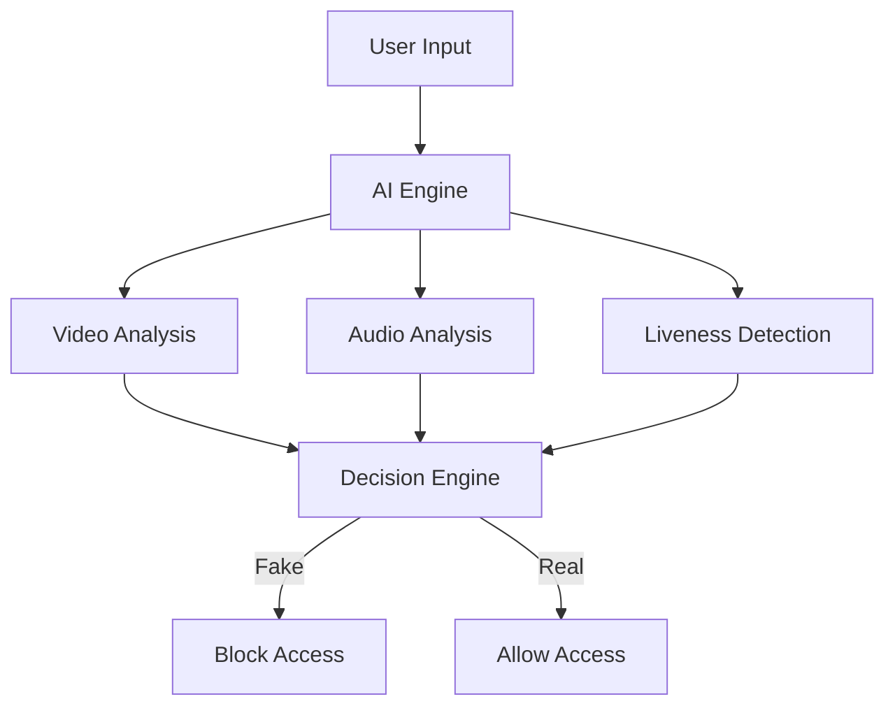

# 🚀 VERILENS-AI: Deepfake Detection & Liveness Verification System

<div align="center">


### 🛡️ Detect • Verify • Protect

AI-powered system to detect deepfakes and verify real human presence in real-time

</div>

---

## 🏆 Why This Project Wins

- ⚡ Real-time Deepfake Detection  
- 🧠 Multi-Model AI Approach  
- 🔐 Biometric Liveness Verification  
- 🎯 High Accuracy (97% voice detection)  
- 🛑 Automatic Threat Blocking  

---

## 🧠 Features

- 🎥 Deepfake video detection  
- 🎙️ AI voice clone detection  
- 👁️ Eye-blink & behavior tracking  
- ❤️ rPPG pulse detection  
- 🔁 Replay attack detection  
- 🛡️ Secure identity verification  

---

## 🏗️ System Architecture



---

## 📊 Accuracy

| Type | Accuracy |
|------|---------|
| Voice Deepfake | 97.1% |
| Video Deepfake | 76.1% |
| Replay Attack | 60.2% |

---

## ⚙️ Tech Stack

- Frontend: HTML, CSS, JavaScript  
- Backend: Python (Flask)  
- ML: Random Forest, Autoencoder, LOF, K-Means  

---

## 📸 Screenshots


---

## ⚡ Installation

```bash
git clone https://github.com/your-username/verilens-ai.git
cd verilens-ai
pip install -r requirements.txt
python app.py
```

---

## 🎯 Future Scope

- Cloud deployment  
- Mobile app integration  
- Advanced deep learning models  

---

## 🛡️ Impact

Ensures secure digital identity by preventing deepfake fraud and identity spoofing.

---

## 👩‍💻 Team

Sahana & Group  
B.V.V.S Polytechnic  

---

⭐ Star this repo if you like it!
