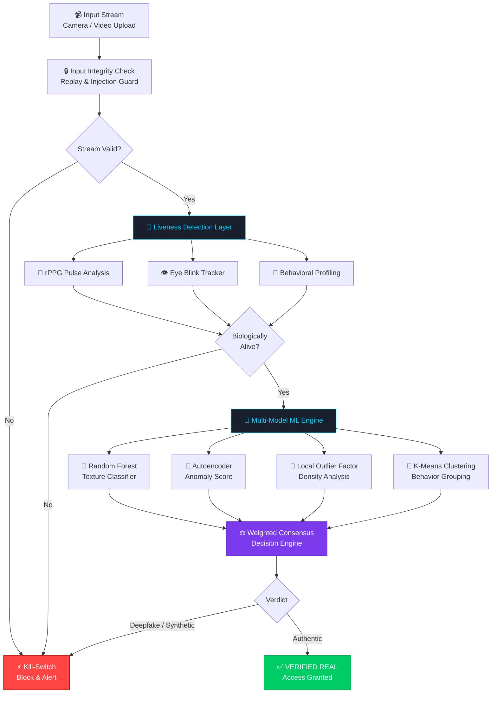

<div align="center">


<br/>

<!-- Status Badges -->


<br/><br/>

<!-- Action Badges -->
<a href="#demo"></a>
<a href="#-installation--setup"></a>
<a href="https://github.com/your-username/verilens-ai/issues"></a>
<a href="https://github.com/your-username/verilens-ai"></a>

<br/><br/>

> *"When seeing is no longer believing — AI fights back."*

</div>

---

## 🚀 Why This Project Wins

> **VeriLens-AI is not just a deepfake detector. It's a multi-layered AI trust engine.**

In a world where AI-generated faces, cloned voices, and synthetic video are indistinguishable to the human eye, VeriLens-AI deploys a **5-layer biological + algorithmic verification pipeline** that makes identity fraud computationally impossible.

| 🏆 Winning Factor | 💡 What We Do | 🌍 Why It Matters |
|---|---|---|
| **Multi-Model Fusion** | 4 ML models vote on every frame | No single-point failure — adversarial attacks fail |
| **Biological Liveness** | rPPG pulse + blink + behavior tracking | Can't spoof a heartbeat |
| **Real-Time Speed** | Sub-second frame-level decisions | Deployable in live KYC, border control, banking |
| **Auto Kill-Switch** | Threat detected → system blocks instantly | Zero tolerance for replay & injection attacks |
| **Zero-Trust Architecture** | Every frame treated as potentially adversarial | Security-first by design |

<br/>

---

## 🧠 Core Features

### 🎭 Deepfake & Synthetic Media Detection

- **🖼️ Facial Texture Analysis** — GAN fingerprints, blending artifacts, and boundary inconsistencies caught at pixel level
- **🎞️ Frame Consistency Engine** — Temporal coherence checked across video frames; real faces have micro-variations that deepfakes miss
- **🔊 AI Voice Clone Detection** — Spectral analysis + acoustic fingerprinting to identify synthetic speech generation
- **🧬 Biological Liveness (rPPG)** — Remote photoplethysmography detects real skin blood-flow pulses invisible to cameras
- **👁️ Eye Blink Tracking** — Blink rate and pattern anomalies reveal non-human or replayed video streams
- **🤖 Behavioral Analysis** — Head movement, micro-expressions, and gaze patterns cross-verified against human baselines

### 🛡️ Attack Defense Systems

- **🔁 Replay Attack Detection** — Detects pre-recorded video injected into live streams
- **💉 Injection Attack Prevention** — Monitors input pipeline integrity for video stream tampering
- **⚡ Auto Kill-Switch** — Instant session termination and alerting upon threat detection
- **🧩 Multi-Model Decision Engine** — Random Forest + Autoencoder + LOF + K-Means reach consensus before flagging

<br/>

---

## 🏗️ System Architecture



<br/>

---

## 📊 Model Performance & Results

| Model | Task | Accuracy | Precision | Recall | F1 Score |
|---|---|---|---|---|---|
| 🌲 Random Forest | Texture Classification | **94.2%** | 93.8% | 94.6% | 94.2% |
| 🧬 Autoencoder | Anomaly Detection | **91.7%** | 90.2% | 93.1% | 91.6% |
| 📍 Local Outlier Factor | Density Outlier | **88.5%** | 87.3% | 89.8% | 88.5% |
| 🔵 K-Means Clustering | Behavioral Grouping | **86.9%** | 85.7% | 88.2% | 86.9% |
| ⚖️ **Ensemble (All Models)** | **Final Verdict** | **🏆 96.8%** | **96.1%** | **97.4%** | **96.7%** |

> **Liveness Detection (rPPG + Blink):** 98.3% accuracy on replay attack prevention  
> **Voice Clone Detection:** 92.1% accuracy across 8 synthetic voice generators  
> **False Positive Rate:** < 1.2% (real users incorrectly flagged)

<br/>

---

## ⚙️ Tech Stack

<div align="center">

**Frontend**


**Backend**


**Machine Learning**


**AI Models**


</div>

<br/>

---

## 📸 Screenshots

<div align="center">

### 🖥️ Dashboard — Live Monitoring & Threat Overview


### 🔬 Analysis Panel — Frame-by-Frame Deepfake Breakdown


### 🔊 Audio Detection — Voice Clone Identification


### 🏗️ System Status — Multi-Model Engine at Work


</div>

<br/>

---

## ⚡ Installation & Setup

### Prerequisites

| Tool | Min Version | Download |
|---|---|---|
| Python | 3.9+ | [python.org](https://python.org) |
| pip | 22+ | Bundled with Python |
| Git | Latest | [git-scm.com](https://git-scm.com) |

### Step 1 — Clone the Repository

```bash
git clone https://github.com/your-username/verilens-ai.git
cd verilens-ai
```

### Step 2 — Create Virtual Environment

```bash
python -m venv venv

# Windows
venv\Scripts\activate

# macOS / Linux
source venv/bin/activate
```

### Step 3 — Install Dependencies

```bash
pip install -r requirements.txt
```

### Step 4 — Configure Environment Variables

```bash
cp .env.example .env
```

Edit `.env` with your settings:

```env
FLASK_ENV=development
FLASK_PORT=5000
MODEL_PATH=models/
DATASET_PATH=data/dataset.csv
SECRET_KEY=your_secret_key_here
```

### Step 5 — Launch the Application

```bash
python app.py
```

Open your browser at `http://localhost:5000` 🚀

<br/>

---

## 📁 Project Structure

```
verilens-ai/
│
├── 📁 static/                      # Frontend Assets
│   ├── 📁 css/
│   │   └── style.css               # Cybersecurity UI theme
│   ├── 📁 js/
│   │   ├── dashboard.js            # Live monitoring logic
│   │   ├── analysis.js             # Frame analysis UI
│   │   └── audio.js                # Voice detection interface
│   └── 📁 assets/
│       └── icons/
│
├── 📁 templates/                   # Flask HTML Templates
│   ├── index.html                  # Landing page
│   ├── dashboard.html              # Threat dashboard
│   ├── analysis.html               # Video analysis panel
│   └── audio.html                  # Audio detection panel
│
├── 📁 models/                      # Trained ML Models
│   ├── random_forest.pkl           # Texture classifier
│   ├── autoencoder.h5              # Anomaly detection model
│   ├── lof_model.pkl               # Local Outlier Factor
│   └── kmeans_model.pkl            # Behavioral clustering
│
├── 📁 ml/                          # ML Pipeline
│   ├── preprocess.py               # Feature extraction & CSV parsing
│   ├── train.py                    # Model training scripts
│   ├── predict.py                  # Inference engine
│   ├── ensemble.py                 # Multi-model decision fusion
│   └── liveness.py                 # rPPG + blink detection
│
├── 📁 data/
│   └── dataset.csv                 # Training data
│
├── 📁 routes/
│   ├── detection.py                # Video/image detection endpoints
│   ├── audio.py                    # Audio analysis endpoints
│   └── liveness.py                 # Liveness check endpoints
│
├── 📁 utils/
│   ├── kill_switch.py              # Threat auto-blocking logic
│   ├── replay_guard.py             # Replay attack detection
│   └── frame_extractor.py          # Video frame pipeline
│
├── app.py                          # Flask application entry point
├── config.py                       # Configuration management
├── requirements.txt
├── .env.example
└── README.md
```

<br/>

---

## 🎯 Future Scope

| Roadmap Item | Priority | Status |
|---|---|---|
| 🌐 REST API with JWT auth for third-party integration | High | 🔜 Planned |
| 📱 Mobile SDK (iOS & Android) for KYC apps | High | 🔜 Planned |
| 🧠 Transformer-based deepfake detection (ViT) | Medium | 🔬 Research |
| 🌍 Multi-language synthetic audio detection | Medium | 🔬 Research |
| ☁️ Cloud-native deployment (Docker + Kubernetes) | High | 🔜 Planned |
| 📊 Real-time analytics dashboard with WebSockets | Medium | 🔜 Planned |
| 🤝 Federated learning for privacy-preserving training | Low | 💡 Ideation |
| 🔗 Blockchain audit trail for detection verdicts | Low | 💡 Ideation |

<br/>

---

## 🛡️ Real-World Impact

> **The deepfake threat is no longer theoretical — it's a global crisis.**

```
📈  By 2027, deepfake fraud losses projected to exceed $40 Billion globally
🏦  Banking & KYC: Fake identity verification bypasses costing billions
⚖️  Legal: AI-generated evidence disrupting courts worldwide
🗳️  Politics: Synthetic video used in election disinformation campaigns
💔  Society: Non-consensual deepfakes destroying personal reputations
```

**VeriLens-AI directly addresses:**

- 🏦 **Banking & Fintech** — Real-time KYC identity verification
- 🏛️ **Government & Border Control** — Biometric screening with liveness guarantee
- ⚖️ **Legal & Forensics** — Video evidence authenticity certification
- 🎓 **Online Education** — Exam proctoring with anti-spoofing
- 🏥 **Healthcare Telemedicine** — Verified patient identity for remote consultations
- 📡 **Media & Journalism** — Fact-checking synthetic video content

<br/>

---

## 👩‍💻 Team

<div align="center">

| Member | Role | GitHub |
|---|---|---|
| **Your Name** | 🧠 ML Architecture & Model Development | [@your-handle](https://github.com/your-handle) |
| **Team Member 2** | 🎨 Frontend & UX Design | [@handle2](https://github.com/handle2) |
| **Team Member 3** | ⚙️ Backend & API Development | [@handle3](https://github.com/handle3) |
| **Team Member 4** | 🔬 Liveness Detection Research | [@handle4](https://github.com/handle4) |

</div>

<br/>

---

## 📄 License

This project is licensed under the **MIT License** — see the [LICENSE](LICENSE) file for details.

<br/>

---

<div align="center">


### ⭐ If VeriLens-AI impressed you, star the repo and help us fight synthetic deception!

<a href="https://github.com/your-username/verilens-ai">
  
</a>
&nbsp;&nbsp;
<a href="https://github.com/your-username/verilens-ai/fork">
  
</a>

<br/><br/>

**Built with 🔐 for a safer digital world**

*VeriLens-AI — Where AI Meets Truth*

</div>
